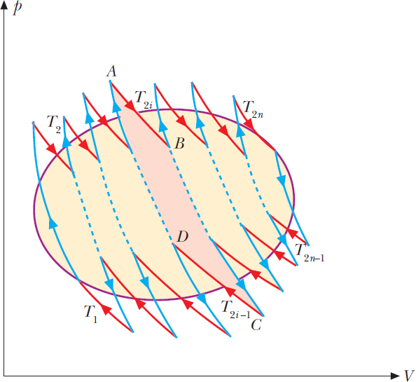

- Prendendo in cosiderazione quanto detto nel teorema di Carnot cioé che il rendimeneto di una qualsiasi macchina termica e sempre minore uguale al rendimenti di una macchina reversibile e scrivendo le espressioni per il calcolo del rendimento otteniamo:
- $$1 + \frac{Q_1}{Q_2} = \eta \leq \eta_R = 1 - \frac{T_1}{T_2}$$
- Facendo manipolazioni matematiche arriviamo al risultato:
- $$ \frac{Q_1}{T_1}  \leq  - \frac{Q_2}{T_2} \Rightarrow \frac{Q_1}{T_1}  + \frac{Q_2}{T_2} \leq 0$$
- Per ogni sorgente posso definire una quantitá che é pari alla calore che la sorgente ha scambiato diviso la temperatura a cui opera. Sommando tutte queste quantitá per tutte le sorgenti coinvolte nella trasformazione il risultato deve essere minore di zero se la trasformazione non é reversibile, esattamente uguale a zero se reversibile.
- Con piú sorgenti possiamo scrivere:
	- $$\sum_{i=1}^N\frac {Q_i}{T_i} \leq 0$$
	- Questo perché possiamo prendere una generica trasformazione ciclica e suddividerla utilizzando tanti cicli di Carnot in questo modo:
	- {:height 553, :width 594}
	- Per approssimare sempre meglio in ciclo in figura abbiamo bisogno di dividerlo sempre in piú cicli di Carnot fino a far tendere il numero di cicli all'infinito passando cosí all'integrale:
	- $$\oint \frac {\delta Q}{T} \leq 0$$
	- Come per la sommatoria questo integrale sará pari a zero se la trasformazione é reversibile mentre é strettamente minore di zero se la trasformazione é irreversibile.