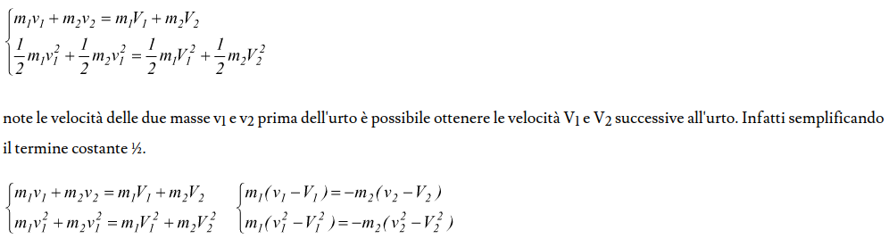
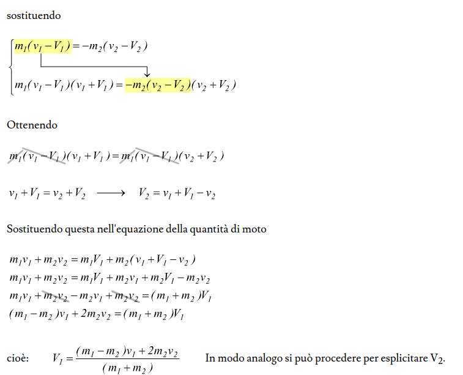
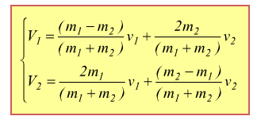

- Un urto é un fenomeno caratterizzato da una contatto molto violento per un tempo molto piccolo tra due corpi.
- Prendiamo per esempio due punti materiali che si scontrano e supponiamo che il sistema composto da questi due punti sia isolato, cioé che non agiscono forze esterne. Da mometo che sul sistema non agoscono forze esterne la variazione della quantitá di moto del sistema deve essere nulla, cioé la quantitá di moto del sistema si conserva (per la prima equazione cardinale).
- Le forze che agiscono durante l'urto dei due punti sono forze interne che modificano la quantitá di moto di ogni singolo punto (non quella totale del sistema). Queste forze che agiscono in un lasso di tempo molto piccolo in modulo sono molto grandi, al limite infinite se l'intervallo di tempo tende a zero.
- Il perché di cioé viene spiegato di seguito:
- [[draws/2023-07-19-16-40-03.excalidraw]]
- Questo dimostra anche che se il sistema non fosse isolato ma su di esso aggissero solamente forze esterne non impulsive In prima approssimazione potremo comunque considerale la quantitá di moto constante perché l'impulso di una forza in modulo piccola in un intervallo di tempo molto piccolo risulterá infinitesimo.
- Adesso prendiamo effettivamente in cosiderazione l'urto tra due punti materiali
- [[draws/2023-07-19-16-48-10.excalidraw]]
- Gli urti si possono dividere in due classi:
- Urti elestici, nei quali oltre alla quantitá di moto di conserva anche l'energia cinetica
	- Per risolvere un problema con degli urti elastici possiamo:
	- 
	- 
	- Quindi quello che andremo ad ottenere sará:
	- 
- Urti anelastici dove si conserva solamente la quantitá di moto